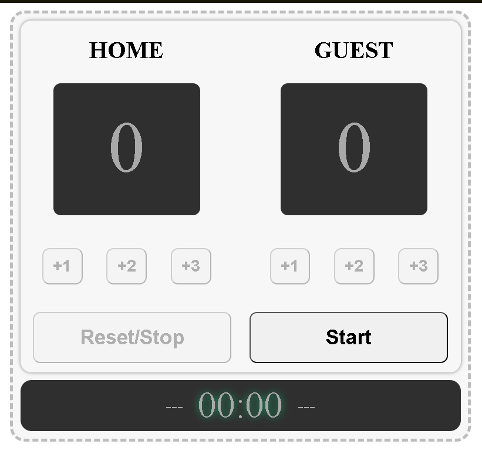

# 🏀 Basketball Scoreboard

A minimalist basketball scoreboard built with **HTML, CSS, and JavaScript**.  
This project allows users to track scores for **Home vs Guest teams** and includes a live game timer.

The design focuses on simplicity, usability, and interactive UI elements.

---

## 🔗 Live Project

👉 https://scoreboard-basketball-alam.netlify.app

Open the link and **have fun with the scoreboard**.

---

## ✨ Features

- Home and Guest score tracking
- +1, +2, +3 scoring buttons
- Game timer
- Reset functionality
- Minimalist scoreboard UI
- Interactive hover and press effects
- Disabled controls before game start

---

## 🛠️ Built With

- HTML  
- CSS  
- JavaScript  

---

## 📚 Learning Journey

I am currently learning **Full-Stack AI Web Development** through Scrimba.

Learn here:  
https://scrimba.com/?via=u43a7734

---

## 💻 GitHub

Explore my other projects here:  
https://github.com/ThisisAlam

---

## 👤 Author

**Fakhar Alam**

GitHub:  
https://github.com/ThisisAlam

---

## 📸 Project Preview

